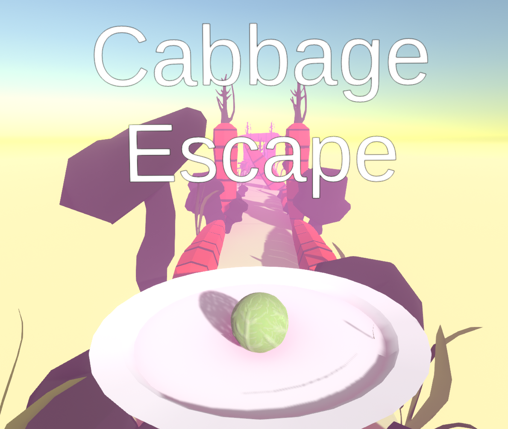

# CabbageEscape
My first* Unity game: A cabbage trying to run as far away as possible from its plate

You're rolling along an infinitely long plane with procedurally generated carrots littered throughout (as a cabbage, one touch and you're dead). The aim is to dodge the carrots and not fall off the plane into the void below for as long as you can.

^ video demonstration

---
*I used to make a bunch of Unity games as a kid back in 2014/2015, but this is my first time touching Unity again after 5-6 years
